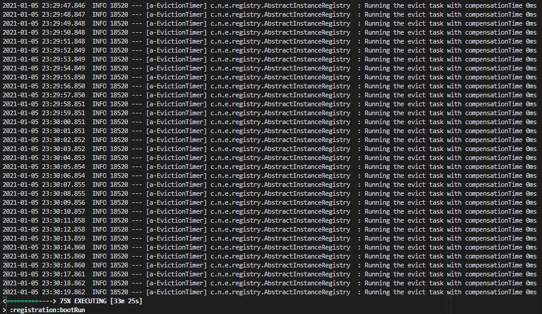
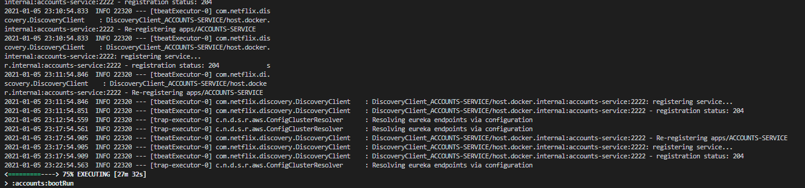
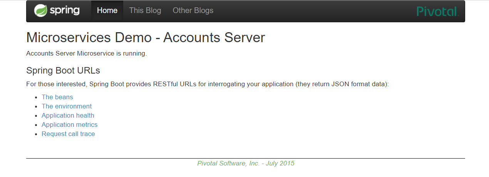
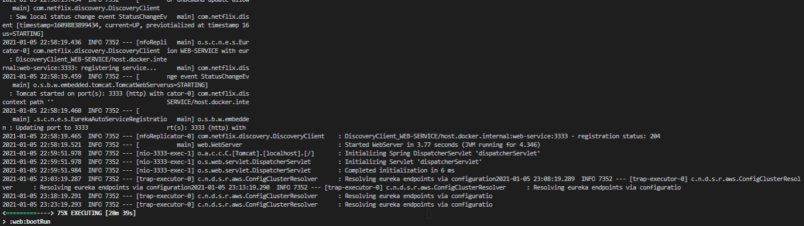
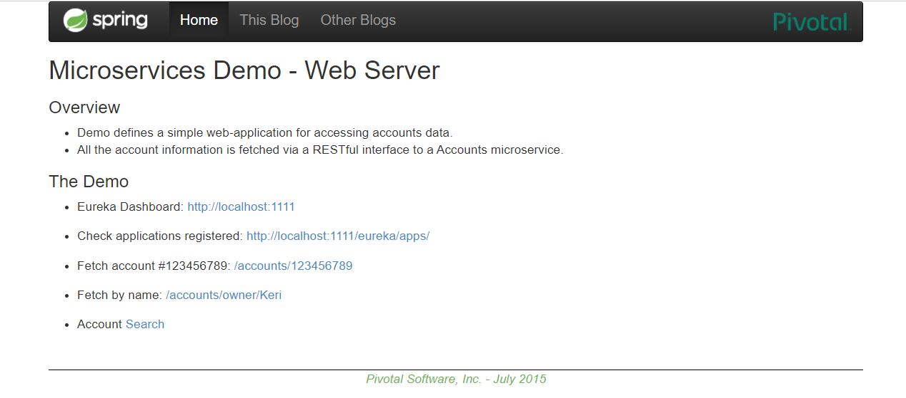
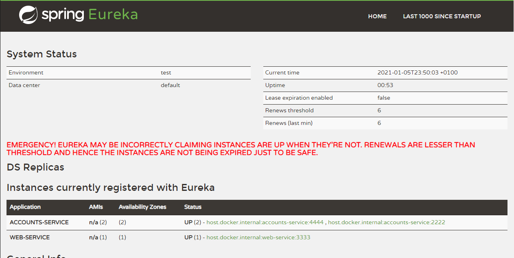
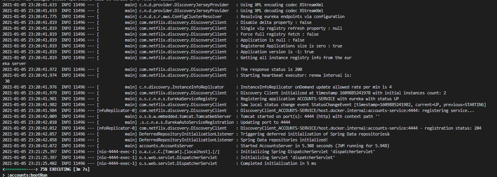
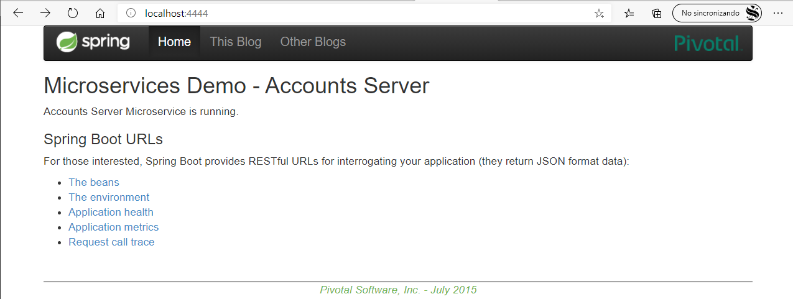

Para comenzar, se lanza el servcio de Eureka de registro, de forma que cuando se inicien los otros dos servicios se puedan registrar con éxito.

    gradle :registration:bootRun
    

    
Posteriormente lanzamos los microservicios de accounts y web:
    
Accounts:

    gradle :accounts:bootRun
  

En el navegador:

Web:

    gradle :web:bootRun
   

En el navegador:

Comprobamos como se han registrado los servicios en el servidor de eureka:

Se observa que están todos los servicios registrados, esto se debe a que la captura se ha sacado con el siguiente servicio activo.
Se ha lanzado otra instancia de accounts con puerto 4444 en lugar de 2222:

    gradle :accounts:bootRun --args='--server.port=4444'
  

En el navegador:

Tras esto se nos plantea una pregunta, ¿si se desconecta el servicio accounts en el puerto 2222, sigue habiendo servicio de usuarios?

La respuesta es si, aunque el servicio de accounts del puerto 2222 ya no esté activo, sigue habiendo una instancia funcional del mismo, por lo que el servidor de registro devuelve el servicio de accounts en el puerto 4444 para que responda a las peticiones sobre usuarios.
